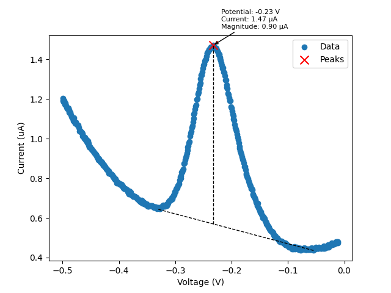

## Processing PSTrace SWV Measurements

Prerequisites: Python 3+ installed on the machine. PalmSens PSTrace, unless using existing exports.

1. Export measurements from PSTrace. The export should be an Excel spreadsheet.
2. Import the spreadsheet under `swv_processing/sheets/`. There are sample imported spreadsheets available to validate the export.
3. In `swv_processing.py`, change `SPREADSHEET_NAME` to the filename that was imported.
4. On a terminal, install the necessary Python libraries:
```shell
cd swv_processing
pip3 install -r requirements.txt
```
5. Run `swv_processing.py` through VSCode, an IDE, or through the terminal with:
```shell
python3 -m swv_processing
```
`pstrace_separation.py` separates the spreadsheet containing all concentrations into individual CSV files. `swv_peak_finder.py` takes each concentration and finds/plots the SWV peaks.
6. Once successfully run, the results are placed in `/csv` and `/figs`. There is also a summary of $A$ and $\tau$ values for each concentration under `/csv/summary.csv`. It should look something like this:

<div align="center">

| Conc. | $A$   | $\tau$ |
|-------|-------|--------|
| 0.1   | 0.002 | 0.5    |
| 0.2   | 0.004 | 0.6    |
| 0.3   | 0.006 | 0.7    |
| 0.4   | 0.008 | 0.8    |
| ...   | ...   | ...    |

</div>

Each measurement also contains a CSV with collected data points. Here's a sample:

<div align="center">

| Voltage [V]       | Current [uA]       |
|-------------------|--------------------|
| -0.0009765625     | 0.5762577056884766 |
| -0.0019140243530273438 | 0.5314350128173828 |
| -0.0029296875     | 0.5156993865966797 |
| -0.003945350646972656 | 0.5075931549072266 |
| ...   | ...   | ...    |

</div>

Note that `scipy.find_peaks()` is used to locate the bases and peak, while the magnitude is calculated using a bisection method similar to the PSTrace peak finding algorithm. Here is a sample figure:

<div align="center">



**Figure 1**: Sample Peak Finding Plot

</div>