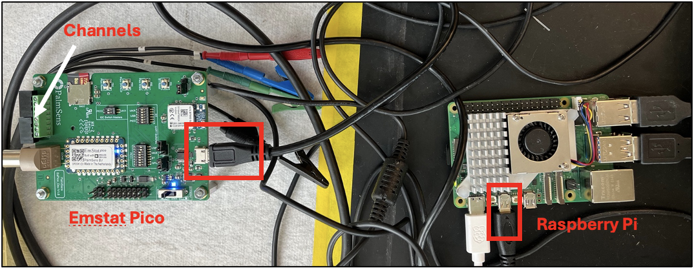
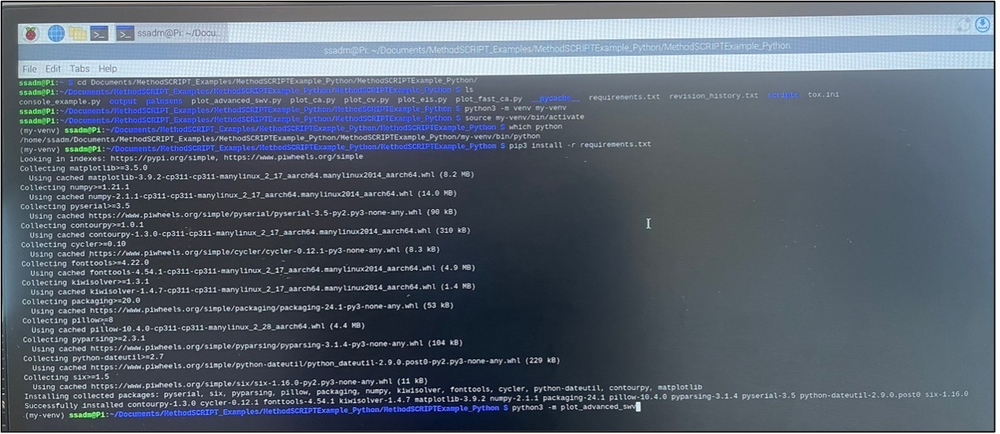
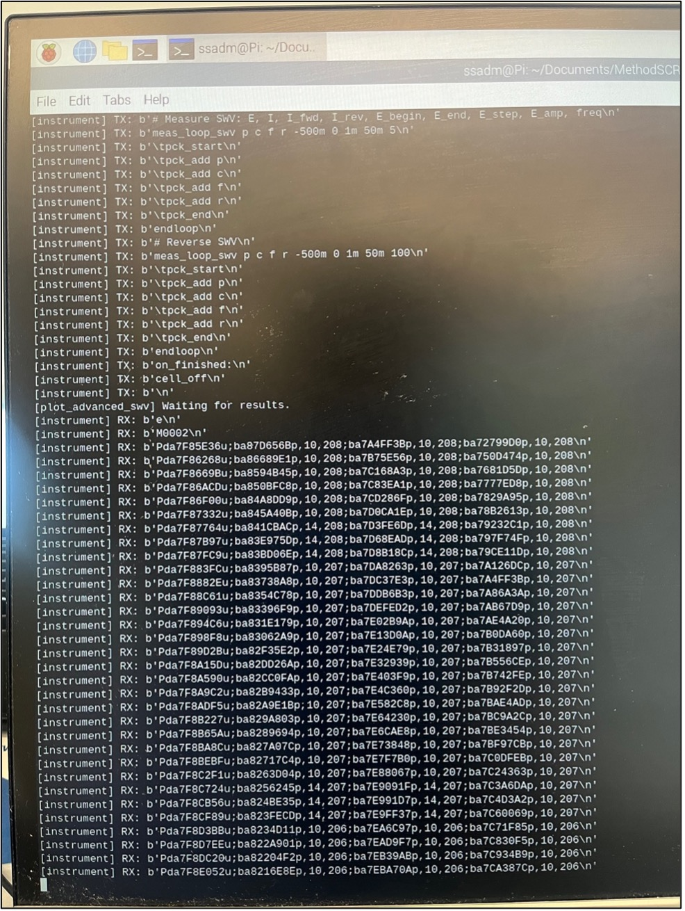
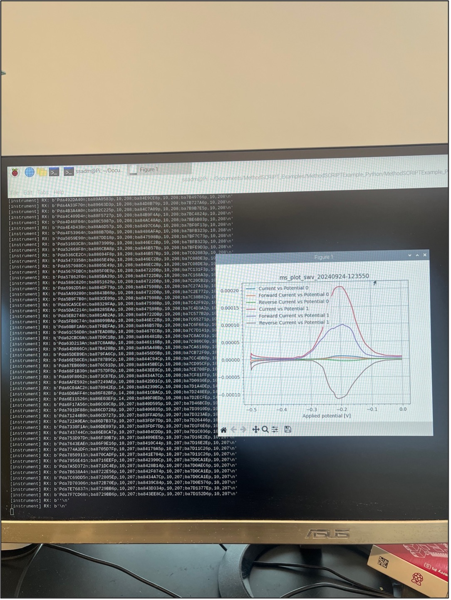
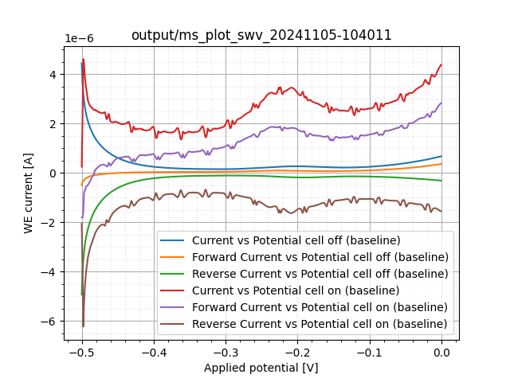
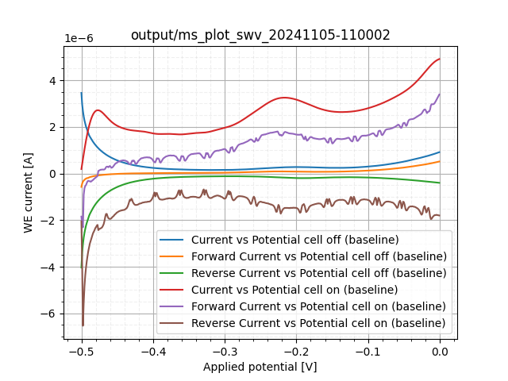
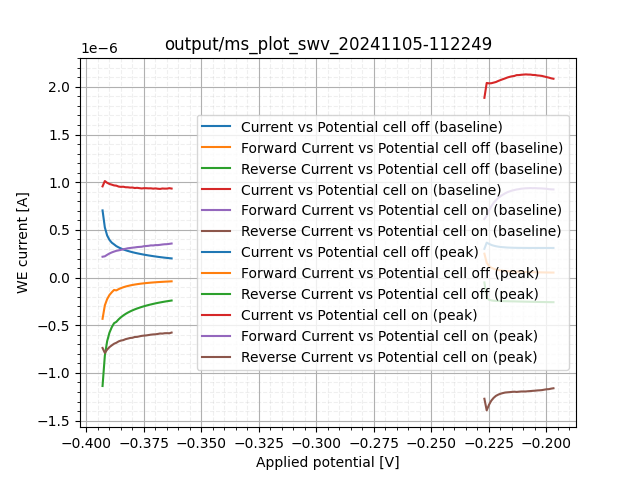
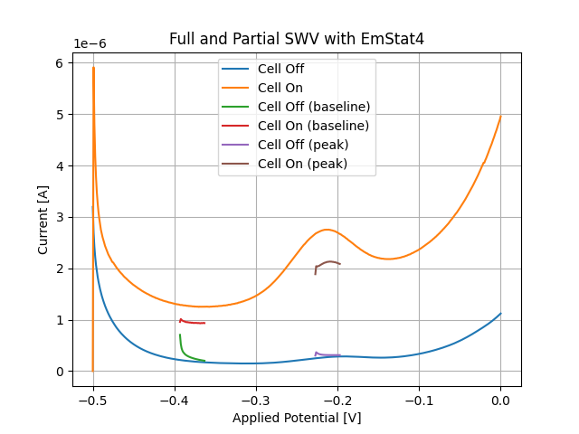

# Plotting Full SWV with Raspberry Pi and Emstat4 or Emstat Pico Guide

## Authors
**Author:** Adam Mak (maka9)  
**Co-Supervisor:** Sadman Sakib (sakibs)

---

## Hardware Guide

The Raspberry Pi should have 5 connections (ideally):
1. **Power Supply**
2. **Monitor**
3. **Keyboard**
4. **Mouse**
5. **Emstat4 or Emstat Pico**

### Channels

| **Device**       | **Connection** |
|-------------------|----------------|
| Raspberry Pi      | Monitor, Keyboard, Mouse, Power Supply |
| Emstat Pico       | Connected to Raspberry Pi |

<div align="center">

  
**Figure 1**: Raspberry Pi and Emstat Pico setup (not shown: peripherals).

</div>

---

## Software Guide

### Prerequisites
All steps are done on the Raspberry Pi.  

#### Using PalmSens Examples
PalmSens provides examples for plotting a few electrochemical techniques in multiple languages. This guide focuses on using Python to plot SWV (Square Wave Voltammetry), utilizing `matplotlib` for plotting.

#### Cloning the Repository
To access the required scripts, clone the PalmSens repository into a directory of your choice. Open the Raspberry Pi’s terminal and run:

```bash
git clone https://github.com/PalmSens/MethodSCRIPT_Examples.git
```

Navigate to the directory containing the Python scripts:

```bash
cd <path_to_repo>/swv_scripts
```

---

### Setting up a Virtual Environment
_Note_: If using Windows computer, setting up a virtual environment is not required, although still recommended. MacOS doesn't support MethodSCRIPT devices.
1. **Create a virtual environment**:  
  `my-venv` can be any arbitrary name.
  ```bash
  python3 -m venv --system-site-packages my-venv
  ```

2. **Activate the virtual environment**:  
  ```bash
  source my-venv/bin/activate
  ```

3. **Verify the Python interpreter**:  
  Ensure the terminal points to the Python interpreter in the virtual environment:
  ```bash
  which python
  ```
  Expected output:  
  ```
  /<path>/my-venv/bin/python
  ```

4. **Install required packages**:  
  Use the `requirements.txt` file to install dependencies:
  ```bash
  pip3 install -r requirements.txt
  ```

5. **Run the script as a module**:  
  Note: Do not
   ```bash
   python3 -m plot_advanced_swv
   ```

<div align="center">

  
**Figure 2**: Preliminary steps to run full SWV script.

</div>

### Setting up Physical Environment

Insert electrode with the solution (can be administered before or after the electrode is inserted) into the *first* channel of the Emstat Pico or Emstat4. Only one channel will work, as it is not possible to conduct simultaneous measurements.

---

### Expected Outputs

#### Terminal Output
When running the SWV script, you should see two sets of lines:  
1. **TX**: MethodSCRIPT code being transmitted to the Emstat Pico.  
2. **RX**: Potential and current outputs received from the Emstat Pico during the SWV measurement.

<div align="center">
 

**Figure 3**: Sample output while SWV measurement is being taken.

</div>

#### Plot Output
After the SWV measurement completes, a plot should display the applied potential (default range: -0.5V to 0V). Adjustments to the MethodSCRIPT file (`/methodscripts/swv_es.mscr`) will alter the measurement parameters.

<div align="center">


**Figure 4**: Sample output when SWV measurement is finished (Shows -0.3V to 0.3V).

</div>

---

## Additional Notes
Recommended to run measurements with Emstat4. Emstat Pico was shown to have aliasing effects, that can be solved by using a second-order Butterworth filter.

To apply the butterworth filter to an SWV measurement, the measurement must be conducted first. Then, move the CSV output under `swv_scripts/output` to `swv_scripts/dev/butterworth/csv` and run `butterworth.py`, making sure that the CSV file path is correctly set. The filtered signal is outputted in `swv_scripts/dev/butterworth/output`.

<div align="center">





</div>

<div align="center">

**Figure 5-7**: SWV measurement plot at 100 Hz unfiltered, butterworth filtered, and using Emstat4, respectively.

</div>

Here's a [document](https://mcmasteru365-my.sharepoint.com/:w:/g/personal/maka9_mcmaster_ca/Efdt9OWZqZZOsVK4q_6w3oYBpbUoHyyxUG8_DpgKnCxJOw?e=ourUAt) to use PalmSens MethodSCRIPT Examples repo.

---

# Plotting Partial SWV with Raspberry Pi and Emstat4 or Emstat Pico Guide

Partial SWV measurements provide close results to full SWV measurements with less time and less electrode degradation.

Every $n^{th}$ measurement, including the 1st, a calibration is performed. The calibration scan is a full SWV measurement. The peak and bases of the calibration is used to determine a partial potential scanning window. The following measurements until the next $n^{th}$ measurement will only acquire signal in that window. By default, $n=10$, but can be changed in `plot_advanced_partial_swv.py`.

_Note_: This article provides additional information on partial SWV measurements: [https://www.mdpi.com/2079-6374/12/10/782](https://www.mdpi.com/2079-6374/12/10/782).

The same software and hardware setup for the full SWV measurements is required for the partial SWV measurements. `scan_tracker.json` persists the number of scans and previous calibration peaks/bases between measurements. Everytime a new experiment is conducted (i.e. sets of measurements), `scan_tracker.json` must be reset.
```json
{
    "num_scans": 0,
    "peak": 0,
    "left_baseline": 0
}
```

### Expected Plot Outputs

<div align="center">



**Figure 8-9**: Sample Partial SWV Measurement Plot, and comparison between partial and full SWV measurements.

</div>

# Plotting SWV with Teensy, Raspberry Pi, and Emstat4 or Emstat Pico Guide

## Additional Prerequisites
1. Teensy must be connected to the RPi.
2. The `swv_scripts/teensy/swv_mux/swv_mux.ino` must be compiled and loaded onto the Teensy as a `HEX` file. This can be done using the Arduino IDE or CLI.
3. Install `sudo apt install python3-libgpiod`
4. The RPi **must** but used. The `RPi.GPIO` library enables communication between RPi and Teensy GPIO pins.
